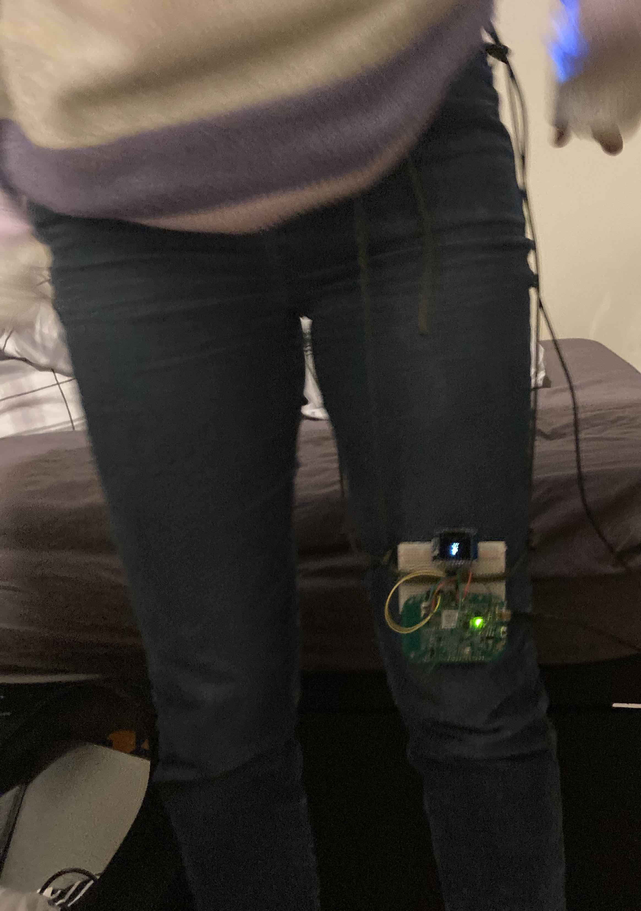

# Modified [Warp](https://github.com/physical-computation/Warp-hardware) firmware for activity tracking with the FRDM-KL03Z
This firmware has been modified from the [Warp firmware](https://github.com/physical-computation/Warp-firmware) to create an activity classifier for the CUED 4B25 Module Coursework Activity 4.

This project should be wired up with the following connections between the FRDM-KL03Z and the SSD1331 carrier board:

| Signal    | KL03 Pin  | OLED Board Pin |
| --- | --- | --- |
| SPI_MOSI | PTA8      | SI |
| SPI_SCK  | PTA9      | CK |
| SPI_CSn  | PTB13     | OC |
| DC        | PTA12     | DC |
| RST       | PTB0      | R |

This project is designed to be attached to the upper thigh in the orientation pictured below. For optimal performance it would be recommended to sew the device into tight fitting trousers in this location, but string can also be used temporarily to hold the device in place

### Acknowledgements
This firmware has been modified by William Vinnicombe (waov2) of Queens' College Cambridge, but maintains the original code structure as described in the [Warp README](WARP_README.md) and uses much of the original code from the [Warp firmware](https://github.com/physical-computation/Warp-firmware). The Warp and Glaux variants have been removed as this code is specialised for the FRDM-KL03Z.